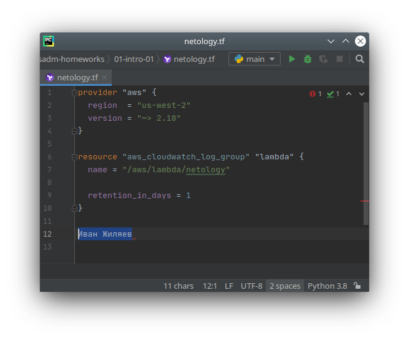
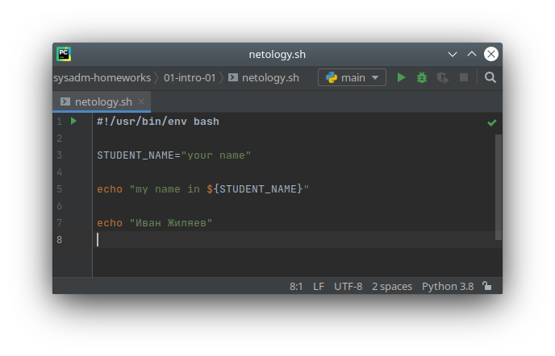
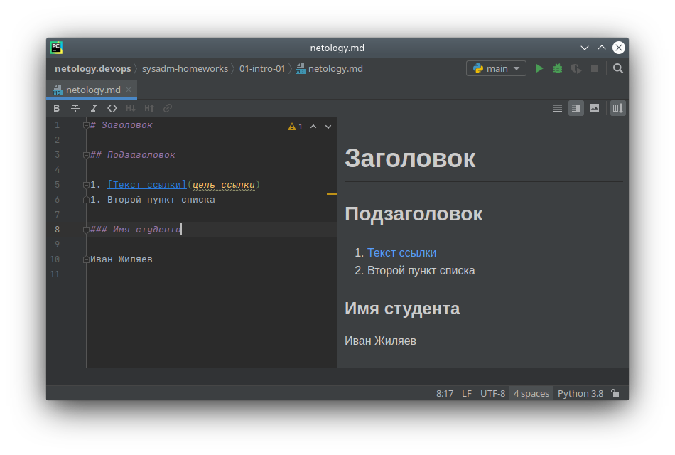
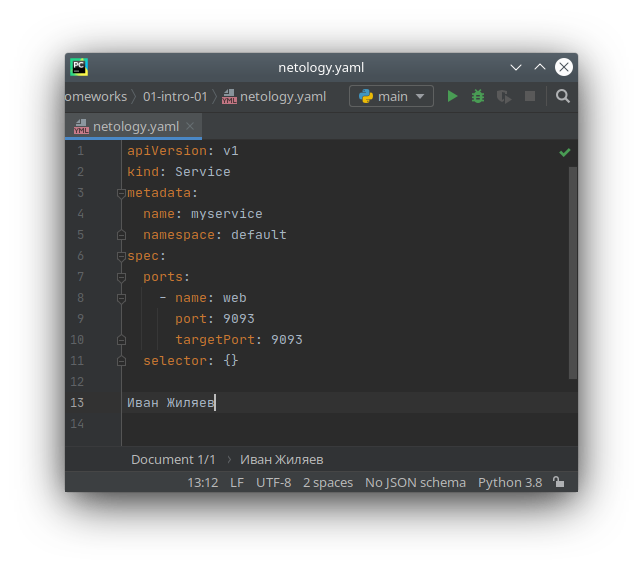
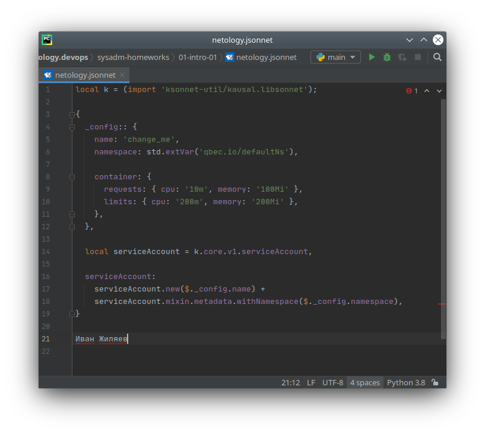

# Домашнее задание к занятию «1.1. Введение в DevOps»

## Задание №1 - Подготовка рабочей среды

Скриншоты с подтверждением работы подсветки синтаксиса:
   - Terraform:  
   
   - Bash:  
   
   - Markdown:  
   
   - Yaml:  
   
   - Jsonnet:  
   

## Задание №2 - Описание жизненного цикла задачи (разработки нового функционала)

Решение задачи я бы начал с организации тикет-системы - раз задач
от клиентов по условию много, то без неё эффективной работы не получится.
Она будет способствовать коммуникации между участниками процесса.

Также изначально стоит перейти к использованию системы версионности кода.

Ответственное за развитие проекта лицо (менеджер или руководитель разработки)
определяет приоритет задач, а также стандарты среды разработки: используемые ЯП,
фреймворки и библиотеки, общую структуру работы программы (например, уровень модульности).

После - разработчики могут приступать к выполнению задач. Их код тестировщики
дополняют необходимыми тестами.

DevOps-инженер, в свою очередь, должен, как минимум, подготовить автоматическую 
проверку, сборку и публикацию нового кода в тестовых средах. Дополнительно
для этих сред желательно настроить сбор логов и мониторинг разнообразных метрик -
так будет проще их контролировать и искать возможные проблемы.

Также возможно будет уместным создание "интеграционных" сборок продукта, в которые
входят промежуточные этапы разработки новой функциональности. Как правило,
такие сборки используют чтобы оценить межмодульное взаимодействие, если продукт
не монолитен. Этот шаг позволит разработчикам шире взглянуть на последствия
внедрения новой функциональности, а менеджеру - продемонстрировать текущий статус 
выполнения работ клиенту, что может обеспечить своевременные корректировки задачи.

После окончания кодирования разработчиками желательно подготовить сборку
"предрелизной" версии продукта в максимально близкой к "боевым" условиям среде.
Чем именно она характеризуется будет зависеть от структуры продукта. Целями этого
этапа могу быть: расширенное тестирование тестировщиками, проверка продукта 
"безопасниками", ещё одна проверка успешной сборки перед публикацией.

Наконец, можно заливать новую версию продукта в "прод". Для возможности быстрого
отката к старому релизу в случае каких-либо проблем необходимо делать публикацию
на основе артефактов - хранимых, неизменяемых, заранее скомпилированных объектов.
Это могут быть как образы для контейнеризации с файлами-описаниями по их 
развёртыванию, так и просто архивы с кодовой базой.

Разумеется, мы должны обеспечть отказоустойчивость, масштабируемость, сбор логов
и, возможно, расширенного набора метрик нашей "производственной" версии продукта.
