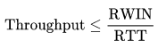

# Домашнее задание к занятию "3.7. Компьютерные сети, лекция 2"

## Модуль 3. Основы системного администрирования

## Студент: Иван Жиляев

Ответы на вопросы из задания:

1. >На лекции мы обсудили, что манипулировать размером окна необходимо для эффективного наполнения приемного буфера участников TCP сессии (Flow Control). Подобная проблема в полной мере возникает в сетях с высоким RTT. Например, если вы захотите передать 500 Гб бэкап из региона Юга-Восточной Азии на Восточное побережье США. [Здесь](https://www.cloudping.co/grid) вы можете увидеть и 200 и 400 мс вполне реального RTT. Подсчитайте, какого размера нужно окно TCP чтобы наполнить 1 Гбит/с канал при 300 мс RTT (берем простую ситуацию без потери пакетов). Можно воспользоваться готовым [калькулятором](https://www.switch.ch/network/tools/tcp_throughput/). Ознакомиться с [формулами](https://en.wikipedia.org/wiki/TCP_tuning), по которым работает калькулятор можно, например, на Wiki.

   Будем пользоваться следующей формулой:

   
   
   Требуемая формула вполне понятна: пропускная способность канала будет не выше чем скорость передачи величины окна (в битах/байтах, после достижения этого лимита отправка будет приостановлена до получения подтверждений о доставке) за время RTT (в секундах, эта задержка определяет через какое время хост-источник сможет получить подтверждения доставки и возобность передачу).  
   Теперь можно "перевернуть" формулу и сказать, что для того, чтобы наполнить 1 Гбит/с канал при 300 мс RTT потребуется окно равное или превышающее __39321 Кбайт__ (произведение скорости канала и RTT преобразованных к единой размерности величины времени и желаемой размерности величины информации). Калькулятор даёт близкое значение в __37500 Кбайт__, однако обоснования разнице с моим значением найти не удалось.

1. >Во сколько раз упадет пропускная способность канала, если будет 1% потерь пакетов при передаче?

   В поисках ответа на это задание помогла статья на Вики из первого вопроса: в ней сказано об `уравнении Матиса`.
   
   

   Оно показывает, что скорость передачи данных в TCP-соединении обратнопропорциональна корню квадратному из вероятности возникновения потерь передачи пакетов. Остальные составляющие уравнения буду рассматривать как константу.
   Чтобы найти "во сколько раз", нужно иметь какую-то базу, "норму". При нулевой вероятности потерь уравнение теряет смысл, т.к. возникает деление на ноль. Обратившить к [этой статье](https://netcraftsmen.com/tcp-performance-and-the-mathis-equation/) я подглядел величину "нормальной" вероятности потерь в 10^-6. Так что в "норме" вероятность ошибок представляется как коэфициент `1000` в расчёте скорости.  
   Теперь, взяв вероятность ошибок в 1% (0,01) коэфициент будет равен `10`. Получается, что скорость упадёт __в 100 раз__.

   В [этом посте](https://netbeez.net/blog/packet-loss-round-trip-time-tcp/) есть хорошие уточнения в определениях терминов, а также видео с примером тестирования падения скорости передачи при заданном проценте потерь (правда, установили аж 10%).  
   Попробуем воспроизвести тесты согласно приведённой в посте инструкции. Для этого создадим две ВМ из [Vagrantfile](vagrant/Vagrantfile) и сперва проведём "чистый" замер скорости, а затем добавим на интерфейс очередь с 1% потерями. Вот вывод эксперимента с клиентской машины:

   ```
   vagrant@client-bw-test:~$ iperf -c 172.28.128.10
   ------------------------------------------------------------
   Client connecting to 172.28.128.10, TCP port 5001
   TCP window size:  340 KByte (default)
   ------------------------------------------------------------
   [  3] local 172.28.128.20 port 39642 connected with 172.28.128.10 port 5001
   [ ID] Interval       Transfer     Bandwidth
   [  3]  0.0-10.0 sec  3.72 GBytes  3.20 Gbits/sec
   
   vagrant@client-bw-test:~$ sudo tc qdisc add dev eth1 root netem loss 1%
   
   vagrant@client-bw-test:~$ iperf -c 172.28.128.10
   ------------------------------------------------------------
   Client connecting to 172.28.128.10, TCP port 5001
   TCP window size:  663 KByte (default)
   ------------------------------------------------------------
   [  3] local 172.28.128.20 port 39644 connected with 172.28.128.10 port 5001
   [ ID] Interval       Transfer     Bandwidth
   [  3]  0.0-10.0 sec  1.63 GBytes  1.40 Gbits/sec
   ```

   Тест показал снижение скорости в __2,29 раз__.

1. >Какая  максимальная реальная скорость передачи данных достижима при линке 100 Мбит/с? Вопрос про TCP payload, то есть цифры, которые вы реально увидите в операционной системе в тестах или в браузере при скачивании файлов. Повлияет ли размер фрейма на это?

   Для достижения максимальной скорости нам необходимо обеспечить условия, при которых во фреймах было как можно меньше служебных данных и больше payload. При расчётах будем считать размер MTU 1500 байт. Так как размеры заголовков IP-пакетов и TCP-сегментов занимают по 20 байт, объём MSS (TCP payload) будет равен 1460 байт.  
   Осталось построить пропорцию: отношение MSS к размеру кадра равно отношению максимальной реальной скорости передачи данных к скорости линка. Из неё получаем искомый ответ: __93,56 Мбит/с (11,7 Мб/с)__.

   Изменение размера фрейма влияет на найденную пропорцию, так что да, это влияет на скорость передачи данных.

1. >Что на самом деле происходит, когда вы открываете сайт? :)
На прошлой лекции был приведен сокращенный вариант ответа на этот вопрос. Теперь вы знаете намного больше, в частности про IP адресацию, DNS и т.д.
Опишите максимально подробно насколько вы это можете сделать, что происходит, когда вы делаете запрос `curl -I http://netology.ru` с вашей рабочей станции. Предположим, что arp кеш очищен, в локальном DNS нет закешированных записей.

   _Вопрос, конечно, крайне многогранный :)_

   После запуска команды на выполнение исполняемый код делает системные вызовы используя переданные команде аргументы.
   Сперва требуется по указанному доменному имени определить адрес, на который команда будет посылать запрос. Предполагаю, что для этого команда в системном вызове делегирует эту работу ядру (_в `strace` этого вызова, к сожалению, найти не смог_). Ядро, следуя алгоритму, заданному в `/etc/nsswitch.conf`, сперва проверит наличие подходящей пары домен-адрес в файлах-справочниках, например в `/etc/hosts`. Если совпадения не будет, то ядро направит запрос указанному в настройках ОС DNS-серверу (возможно, локальному - на этом же хосте). Тот, в свою очередь, проверит свой кеш на наличие подходящих записей, а в случае их отсутствия - сформирует и отправит итеративные DNS-запросы к:
   - корневым серверам
   - затем к серверам национальных доменов
   - и в итоге к серверу, отвечающему за искомый домен `netology.ru`.
   
   Теперь, когда `curl` получил от DNS-сервера ip-адрес цели, он может создать сетевой сокет и сформировать системный вызов `connect()`. Ядро, получив его, проверяет по таблице маршрутизации не находится ли целевой хост в локальном сегменте сети. Если нет, то будет выбран маршрут `default route` (или 0.0.0.0 в Windows); так определится ip-адрес маршрутизатора, которому нужно слать данные, а также интерфейс с которого нужно вести передачу.
   
   Дальше в ход идёт ARP: т.к. цель не находится в локальном сегменте сети, будем слать трафик на маршрутизатор, но пока у нас только его ip-адрес из маршрута по-умолчанию. Смотрим в arp-кеш, но он по условию очищен. Послав широковещательный ARP-запрос и получив ответ можем заполнить поле `dst MAC` для фреймов, подставив MAC-адрес роутера.

   Сейчас у ядра есть всё для формирования и отправки необходимых PDU (блоки данных протоколов) для создания TCP-сессии с сервером:
   - для TCP-сегмента
      - `src port` назначается произвольно из динамического пула
      - `dst port` - думаю, что curl назначил 80 порт как умолчание для протокола http
   - для IP-пакета
      - `src address` - ip-адрес интерфейса через который будет идти передача
      - `dst addres` - ip-адрес ресурса, полученный от DNS
   - для фрейма
      - `src MAC` - MAC-адрес интерфейса отправки
      - `dst MAC` - результат работы ARP, MAC-адрес роутера

   Маршрутизатор, получив фреймы и заглянув в их содержимое, понимает что они должны попасть в цепь NAT. Заполняется таблица соответствия "src ip-адрес и порт хоста в локалке" и "внешний src ip-адрес и порт интерфейса роутера" для этого соединения, чтобы впоследствии знать кому возвращать ответ от сервера.

   Маршрутизацию в провайдерской сети пропущу - немного читал о ней, там много своих нюансов.
   
   Настало время "трёхкратного рукопожатия" между нашим хостом и web-сервером, после которого наш хост может отправить http-запрос вида:
   ```
   HEAD / HTTP/1.1\r\nHost: netology.ru\r\nUser-Agent: curl/7.68.0\r\nAccept: */*\r\n\r\n
   ```

   Ну а получив ответ `curl` выводит заголовки в stdout.

1. >Сколько и каких итеративных запросов будет сделано при резолве домена `www.google.co.uk`?

   Для наглядности можно использовать команду `dig` с опцией `+trace` (см. вывод ниже) - она будет слать итеративные запросы, а не рекурсивный. Практика показала, что для резолва потребовалось __4 запроса__.  
   - Первый - к настроенному в системе или указанному в опциях команды серверу для определения корневых серверов
   - Второй - к корневому серверу для поиска серверов, отвечающих за национальный домен
   - Третий - указал на сервера имён Google, которые держат зону `google.co.uk.`
   - Четвёртый - отдал A-запись интересующего нас доменного имени

   ```
   vagrant@vagrant:~$ dig +trace @8.8.8.8 www.google.co.uk

   ; <<>> DiG 9.16.1-Ubuntu <<>> +trace @8.8.8.8 www.google.co.uk
   ; (1 server found)
   ;; global options: +cmd
   .                       53887   IN      NS      m.root-servers.net.
   .                       53887   IN      NS      b.root-servers.net.
   .                       53887   IN      NS      c.root-servers.net.
   <...>
   ;; Received 525 bytes from 8.8.8.8#53(8.8.8.8) in 47 ms

   uk.                     172800  IN      NS      nsa.nic.uk.
   uk.                     172800  IN      NS      nsb.nic.uk.
   uk.                     172800  IN      NS      nsc.nic.uk.
   <...>
   ;; Received 800 bytes from 198.97.190.53#53(h.root-servers.net) in 63 ms

   google.co.uk.           172800  IN      NS      ns1.google.com.
   google.co.uk.           172800  IN      NS      ns2.google.com.
   google.co.uk.           172800  IN      NS      ns3.google.com.
   <...>
   ;; Received 650 bytes from 213.248.216.1#53(dns1.nic.uk) in 91 ms

   www.google.co.uk.       300     IN      A       64.233.164.94
   ;; Received 61 bytes from 216.239.34.10#53(ns2.google.com) in 79 ms
   ```

   _Прим.: Часть вывода скрыл комбинацией "<...>" для наглядности._

1. >Сколько доступно для назначения хостам адресов в подсети `/25`? А в подсети с маской `255.248.0.0`. Постарайтесь потренироваться в ручных вычислениях чтобы немного набить руку, не пользоваться калькулятором сразу.

   В подсети `/25` доступно 128 адреса; за вычетом адреса сети и широковещательного адреса для назначения хостам остаётся __126 адреса__.  
   Маска `255.248.0.0` в двоичном представлении имеет полностью заполненный битами первый октет и пять установленных бит во втором октете, т.е.  
   `|11111111|11111000|00000000|00000000|`.  
   Полное количество хостов в подсети с такой маской будет равно двойке (как основанию системы счисления) в степени 19 (количество нулевых бит в маске), то есть 524288; вычтем два служебных адреса, как в предыдущем примере, и получим ответ в __524286 адреса__.

1. >В какой подсети больше адресов, в `/23` или `/24`?

   Адресов больше в подсети `/23`, так как хостовая часть этой маски больше на бит. Причём больше в два раза, если учитывать и служебные адреса.

1. >Получится ли разделить диапазон `10.0.0.0/8` на 128 подсетей по 131070 адресов в каждой? Какая маска будет у таких подсетей?

   Запишем данный диапазон `10.0.0.0/8` в двоичном представлении:
   - адрес `|00001010|00000000|00000000|00000000|`
   - маска `|11111111|00000000|00000000|00000000|`

   Теперь найдём какая максимальная длина маски (имею в виду количество установленных бит) подойдёт под условие задачи, т.е. вместит 131070 адреса. Удивительным образом :) подходит маска с 17 нулевыми битами "справа", т.е. нам нужны подсети с маской __/15__.  
   В двоичном представлении:
   - маска `|11111111|11111110|00000000|00000000|`

   Из двоичного представления маски исходного диапазона и найденной маски подсети видно, что на кодирование адресов подсетей у нас остаются первые семь бит второго октета, то есть в заданный диапазон как раз поместится 2^7 = 128 подсетей.

   Расчёты подтвердил калькулятором, всё сошлось: 
   ```
   vagrant@vagrant:~$ ipcalc 10.0.0.0/8 /15
   <...>
    127.
   Network:   10.252.0.0/15        00001010.1111110 0.00000000.00000000
   HostMin:   10.252.0.1           00001010.1111110 0.00000000.00000001
   HostMax:   10.253.255.254       00001010.1111110 1.11111111.11111110
   Broadcast: 10.253.255.255       00001010.1111110 1.11111111.11111111
   Hosts/Net: 131070                Class A, Private Internet

    128.
   Network:   10.254.0.0/15        00001010.1111111 0.00000000.00000000
   HostMin:   10.254.0.1           00001010.1111111 0.00000000.00000001
   HostMax:   10.255.255.254       00001010.1111111 1.11111111.11111110
   Broadcast: 10.255.255.255       00001010.1111111 1.11111111.11111111
   Hosts/Net: 131070                Class A, Private Internet


   Subnets:   128
   <...>
   ```
