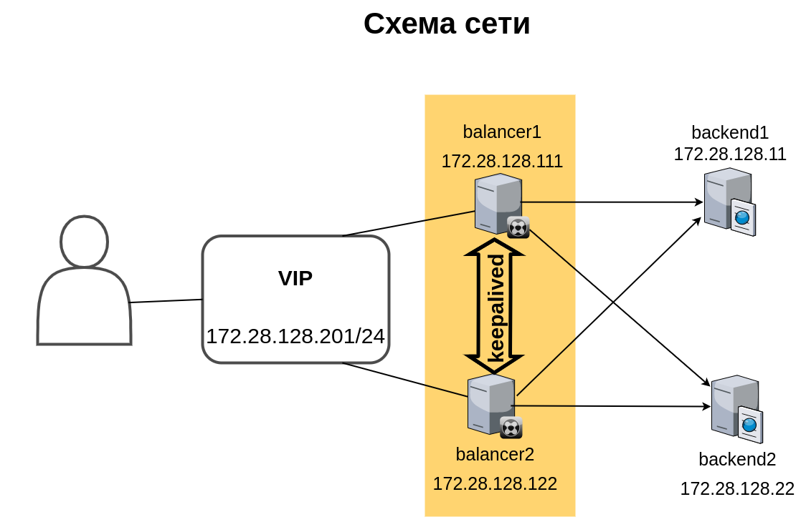
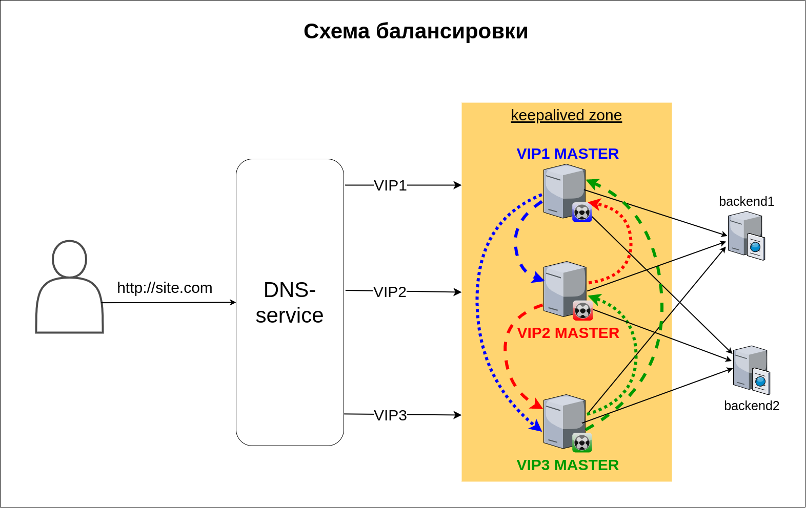

# Домашнее задание к занятию "3.8. Компьютерные сети, лекция 3"

## Модуль 3. Основы системного администрирования

## Студент: Иван Жиляев

Ответы на вопросы из задания:

1. >ipvs. Если при запросе на VIP сделать подряд несколько запросов (например, `for i in {1..50}; do curl -I -s 172.28.128.200>/dev/null; done `), ответы будут получены почти мгновенно. Тем не менее, в выводе `ipvsadm -Ln` еще некоторое время будут висеть активные `InActConn`. Почему так происходит?

   В [этом документе](http://www.austintek.com/LVS/LVS-HOWTO/HOWTO/LVS-HOWTO.ipvsadm.html#ActiveConn) есть описание, что счётчик `InActConn` (неактивных соединений) отображает количество TCP-соединений в статусах отличных от `ESTABLISHED`.  
   В режиме балансировки без трансляции адресов балансер не видит ответа сервера клиенту, соответственно в случаях инициации закрытия соединения со стороны сервера LVS увидит только ответный `FIN` от клиента, то есть он не может достоверно знать точный статус соединения. Поэтому балансировщик даёт такому соединению некий таймаут, помещая его в группу неактивных.

1. >На лекции мы познакомились отдельно с ipvs и отдельно с keepalived. Воспользовавшись этими знаниями, совместите технологии вместе (VIP должен подниматься демоном keepalived). Приложите конфигурационные файлы, которые у вас получились, и продемонстрируйте работу получившейся конструкции. Используйте для директора отдельный хост, не совмещая его с риалом! Подобная схема возможна, но выходит за рамки рассмотренного на лекции.

   Для решения задачи был подготовлен следующий [Vagrantfile](vagrant/Vagrantfile). Он создаёт два бэкенда с `nginx`, два балансировщика, на которые сразу устанавливаются `ipvsadm` и `keepalived`, а также одну "клиентскую" ВМ. Все машины имеют адреса в сети `72.28.128.0/24` на интерфейсе `eth1`.  
   В целом схема выглядит так:

   

   На балансировщиках добавим следующую конфигурацию `ipvsadm`:
   
   ```
   root@balancer{1,2}:~# ipvsadm -A -t 172.28.128.201:80 -s rr
   root@balancer{1,2}:~# ipvsadm -a -t 172.28.128.201:80 -r 172.28.128.11:80 -g -w1
   root@balancer{1,2}:~# ipvsadm -a -t 172.28.128.201:80 -r 172.28.128.22:80 -g -w1
   ```

   На риалах нужные опции ядра `net.ipv4.conf.all.arp_ignore` и `net.ipv4.conf.all.arp_announce` уже выставлены Vagrant-ом чтобы обеспечить нужный режим работы сети.  
   Добавим `VIP`-адрес на `lo` на каждом бэкенде:

   ```
   root@backend{1,2}:~# ip addr add 172.28.128.201/32 dev lo label lo:201
   ```

   Осталось сконфигурировать `keepalived`. Я решил делать проверку статуса службы `ipvsadm` каждые 2 секунды.  
   В `/etc/keepalived/keepalived.conf` на `balancer1` добавим следующий конфиг:

   ```
   vrrp_script chk_ipvsadm {
      script "systemctl status ipvsadm"
      interval 2
   }

   vrrp_instance VI_1 {
      state MASTER
      interface eth1
      virtual_router_id 33
      priority 100 / 50
      advert_int 1
      authentication {
         auth_type PASS
         auth_pass super_strong_password
      }
      virtual_ipaddress {
      172.28.128.201/32 dev eth1
      }
      track_script {
         chk_ipvsadm
      }
   }
   ```

   Конфиг на `balancer2` будет отличаться только строкой `state BACKUP`, а в остальном всё то же самое.

   Проверка показала, что всё работает как и ожидалось: отказоустойчивость балансировщиков (но не риалов) обеспечена, VIP-адрес "переезжает" между ними.

1. >В лекции мы использовали только 1 VIP адрес для балансировки. У такого подхода несколько отрицательных моментов, один из которых – невозможность активного использования нескольких хостов (1 адрес может только переехать с master на standby). Подумайте, сколько адресов оптимально использовать, если мы хотим без какой-либо деградации выдерживать потерю 1 из 3 хостов при входящем трафике 1.5 Гбит/с и физических линках хостов в 1 Гбит/с? Предполагается, что мы хотим задействовать 3 балансировщика в активном режиме (то есть не 2 адреса на 3 хоста, один из которых в обычное время простаивает).

   Если "мы хотим задействовать 3 балансировщика в активном режиме", то и VIP-адресов должно быть минимум такое же количество - `3`.

   Равномерное распределение входящих соединений по трём VIP-ам может обеспечиваться работой DNS-сервера со знакомой схемой распределения запросов `roundrobin`.

   В приведённой схеме подразумевается, что клиентам при резолве доменного имени нашего сайта поочерёдно сообщается один из трёх VIP-адресов, что логически разбивает входящий трафик на три потока. По условиям задания все три потока создают входящий трафик 1.5 Гбит/с, так что сделаю допущение, что каждый поток составляет 0.5 Гбит/с трафика.  
   Если "погаснет" один из балансировщиков, то с помощью `keepalived` его VIP-адрес "переедет" к "соседу". Соответственно он будет принимать трафик двух потоков, общим объёмом 1 Гбит/с.

   

   _На схеме крупным пунктиром обозначен предпочитаемый `BACKUP` для соответствующего VIP, мелким - запасной вариант._

   Однако улилизация линка в 100% - не лучшая идея, надо бы иметь запас. Для более равномерного распределения трафика при отказе одного из балансировщиков можно на каждом хосте "держать" не один, а несколько VIP-ов, чтобы в случае проблем они делились между работающими узлами.  
   Так, если в приведённой схеме будет по два VIP на каждый балансер, то при аварии на одном из них оставшиеся могут "забрать" по одному "осиротевшему" VIP-у. В этом случае нагрузка будет распределена поровну между "выжившими" хостами и составит 0.75 Гбит/с на ноду.

   Так что с точки зрения распределения нагрузки оптимально использовать __шесть VIP-адресов__.